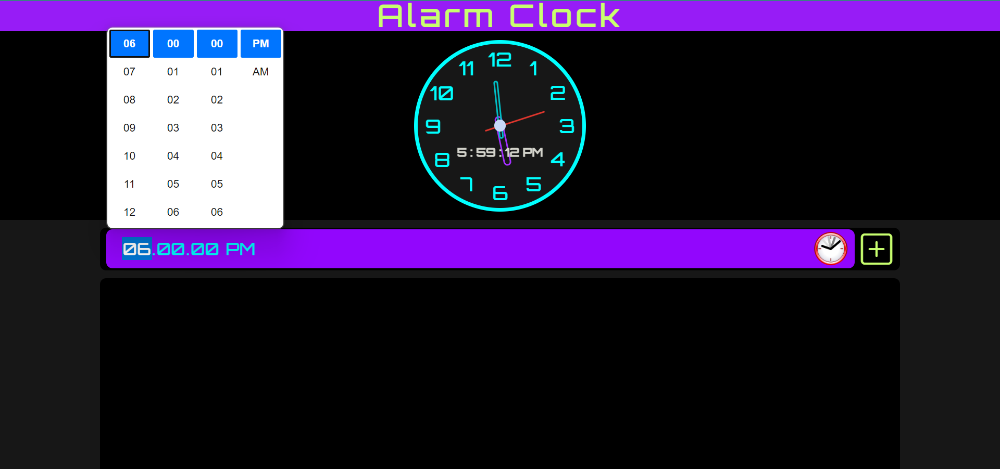
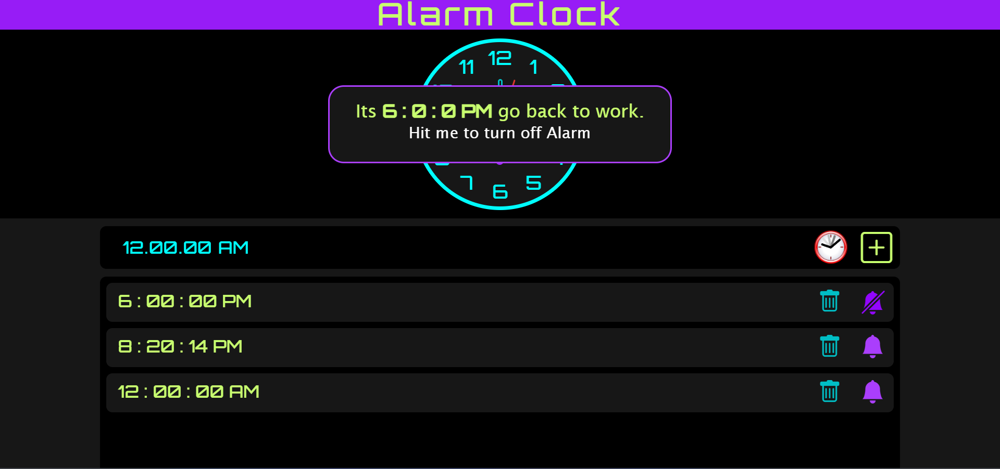

> # [Wake-Me-Up an_Alarm_Clock](https://kapishverma.github.io/Wake-Me-Up-an_Alarm_Clock/ "Want to try? Hit this link")

 >## How to set an alarm?
  1. To set an **Alarm time**
  1. Use **+(plus icon)** or **ENTER Key** to add in alarm list
  1. You will get an **message in console** ( __Alarm Has Been Added Successfully__ )
  ---
  
 >## What to do, if alarm start?
    1. When an alarm start 
    1. you will get an alert message
         ( it's **6:0:0** PM go back to work)
    1. click on alart to turn off alarm

>## Alarm_Clock's features

* There is a **delete** and **bell** icon with every alarm

 * You can use __delete icon, to delete__ the unrequired alarm from list(you will get a massage inside console __Alarm Has Been Successfully Deleted__), 
and 

* __Bell icon to activate and deactivate__ , (with a message __Alarm Has Been Toggled Successfully__)

 * If you try to **add same alarm**, you will get a Message inside console(__Alarm Already Exist__) 
* when you refresh the page or re-visit the page again, your saved alarms will be there,as you left before (**until you delete it from localStorage**).
>  __You can see every event in__ **Console**
